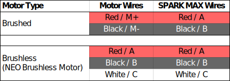

# Power and Motor Connections

SPARK MAX is designed to drive 12V brushed and brushless DC motors at currents up to 60A continuously. Power and motor connections are made through the two sets of wires built into the SPARK MAX. The wires are 12AWG ultra-flexible silicone-coated wire. Each wire runs approximately 15cm from the end faces of the controller. Be sure to take care when cutting and stripping the wires as not to cut them too short. The figure below shows these connections in detail.


As with any electrical component, make all connections with the power turned off. Connecting the SPARK MAX to a powered system may result in unexpected behavior an may pose a safety risk.


## Motor Output

Motor output wires are labeled as A, B, and C with red, black, and white wires. Brushed motors must be connected to the A and B wires, while brushless motors must be connected to all three. **It is critical that the order of the brushless motor wires match the SPARK MAX or the motor will not spin and could be damaged.** Additional details are below.

#### Motor Connections

SPARK MAX cannot detect which motor type it is connected to. Be sure to configure the SPARK MAX to run the type of motor you have connected. See the [Motor Type - Brushed/Brushless Mode](../operating-modes/motor-type-brushed-brushless-mode.md) section for more details on configuring the appropriate motor type.

## Power Input

Power input wires are labeled as V+ and V- with red and black wires. The SPARK MAX is intended to operate in a 12 V DC robot system, however it is compatible with any DC power source between 5.5 V and 24 V.


DO NOT reverse V+ and V- or swap motor and power connections. Doing so will cause permanent damage to the SPARK MAX and will void the warranty.



DO NOT exceed the maximum supply voltage of 30V. Doing so will cause permanent damage to the SPARK MAX and will void the warranty.


When using high current motors, it is recommended to use a power source that is capable of handling large surge currents, e.g. a 12V lead-acid battery. If the supply voltage drops below 5.5V the SPARK MAX will brown out, resulting in unexpected behavior. It is also highly recommended to incorporate a fuse or circuit-breaker in series with the SPARK MAX between it and the power source to prevent exceeding the maximum current rating.


DO NOT exceed the maximum current ratings of 60A or 100A for 2 seconds. Doing so will cause permanent damage to the SPARK MAX and will void the warranty.


